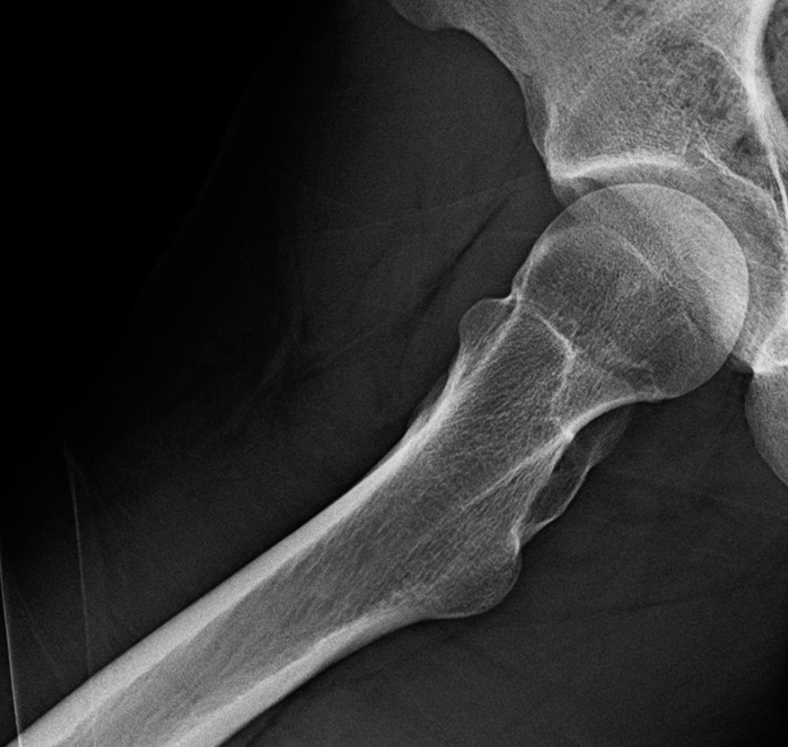
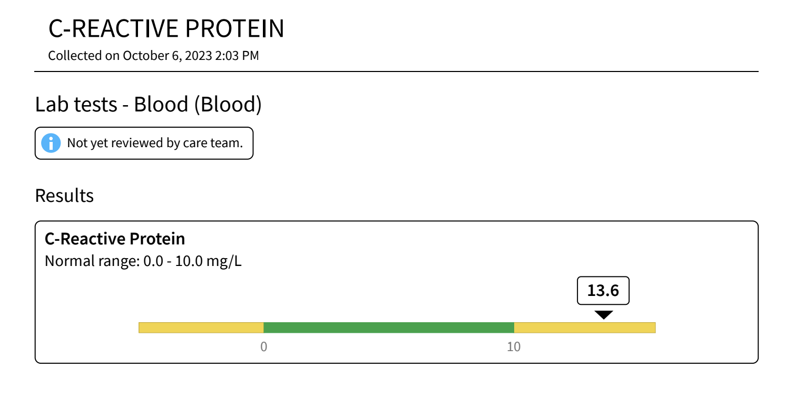
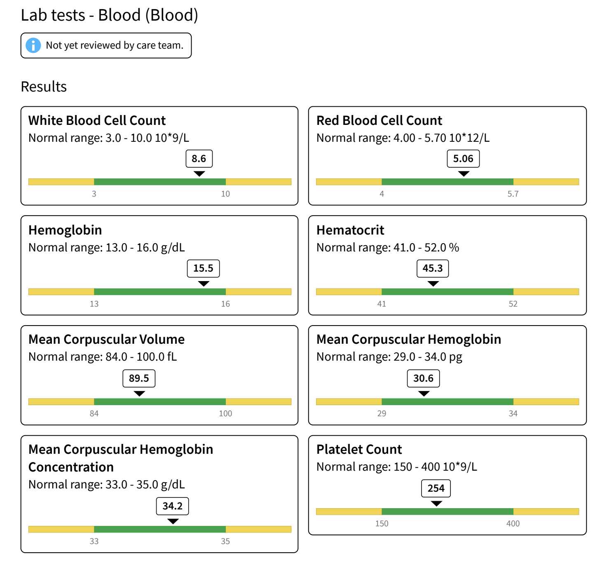
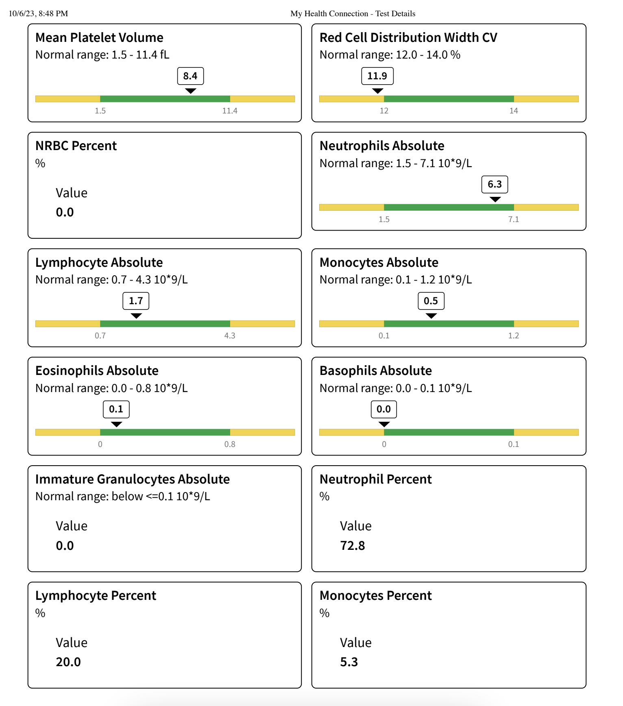
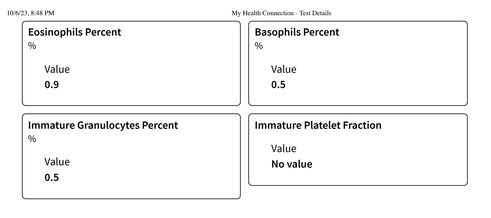

## My Journey with Localized TGCT

I was diagnosed with a localized [Tenosynovial Giant Cell Tumor](https://en.wikipedia.org/wiki/Tenosynovial_giant_cell_tumor) (TGCT) in 2023. I am extremely grateful as my journey with TGCT was short lived. I was diagnosed, treated, and cured in less than year. I am sharing my story to help others who may be going through a similar experience. I hope my story can provide some comfort and guidance to those who are struggling with TGCT.

This page will contain images, medical documents, and other resources that are directly from my TGCT journey. I am including these documents under the open source [MIT license](https://github.com/GrantBirki/tgct/blob/main/LICENSE) so that others can use them, study them and learn from them.

*Let's begin...*

### About TGCT

First, let's talk about what TGCT is. From the *National Organization for Rare Disorders* (NORD):

> "Tenosynovial giant cell tumors (TGCTs) are a group of rare, typically non-life-threatening tumors that involve the synovium, bursae and tendon sheath. These tumors cause the affected synovium, bursae or tendon sheaths to thicken and overgrow. They are benign, which means they are not cancerous and do not spread to other areas of the body (metastasize). However, they can grow and cause damage to the surrounding tissue and structures of the affected limb. Symptoms can include pain, swelling, tenderness, warmth at the location and limitation of movement of the joint. Surgery is often the initial treatment option. However, depending on the subtype, the tumor can recur, particularly in diffuse TGCT which was previously known as pigmented villonodular synovitis (PVNS). If untreated or if the tumor continually recurs, they can result in damage and degeneration of the affected joint and surrounding tissues or structures. Sometimes, they can cause significant disability. In rare cases, amputation is warranted."
>
> "It (TGCT) may occur randomly, for no apparent reason. There are no environmental, genetic, occupational, lifestyle, demographic or regional risk factors that have been conclusively shown to be involved with the development of these tumors."
>
> Incidence: For localized TGCT, 39 cases per 1,000,000 are estimated, whereas for diffuse TGCT, 4 cases per 1,000,00 are estimated.
>
> — <cite>NORD[^1]</cite>

[^1]: [NORD](https://rarediseases.org/rare-diseases/tenosynovial-giant-cell-tumor/)

The short version, is that TGCT is a very rare form of a benign tumor that grows inside of joints. It seems to occur randomly and there are no known risk factors. The tumor(s) can cause quite a bit of discomfort, pain, swelling, and limited joint movement. In more extreme cases, the affected joint(s) can become damaged and degenerate.

This section is mainly included to add some base context around TGCT. In fact, it was some of the early information I first came across when diagnosed. There is a lot more depth to TGCT and I will be sharing more about my experience further down the page.

*Now, let's get into my story...*

### First Symptoms

The first time I experienced my first symptoms of TGCT was early June 2023. I was living in Boulder, CO for half of the year and the other half I was living in London, UK with my partner who was earing her Master's degree at Kings College London. I had just spent about four months in London and returned to Boulder for only a few days before flying to Costa Rica for a work conference. I was in Costa Rica for about a week and then flew back to Boulder. I was run down and had been traveling **a lot**. I decided to hit the gym to try and bounce back from all the travel. I was doing the [adductor](https://en.wikipedia.org/wiki/Adductor_muscles_of_the_hip) machine to work on my hips that day during one of my sets. This was nothing out of the ordinary for me. I had been regularly going to the gym for 4-5 days a week for the last year without an issues. However, this time it would be very different. I did not notice anything out of the ordinary during my workout. I was feeling good and was happy to be back in the gym. I finished my workout and went home. I was feeling a bit sore, but nothing out of the ordinary. I went to bed and that was when I would first notice something was wrong.

I woke up at about 3am in excruciating pain. I had never felt anything like it before. I was in so much pain that I was unable to move my leg into any position that was comfortable. I couldn't sleep and I laid in bed shallow breathing for hours. I kept wondering if I had torn a muscle during my working but it seemed so odd that it would be so delayed (hours) and I hadn't done anything out of my normal routine...

I managed to fall back asleep after taking pain medication and as soon as the sun came up I took an Uber to an urgent care.

At the urgent care, they did a physical exam and the doctor told me that I had a pulled muscle. He had a physical therapist in mind for me to see that also happened to be down the street from my apartment so I was handed a business card. I was told to take it easy and to come back if the pain persisted.

The pain did persit. In fact it was so bad that I couldn't walk or sleep for days. I called my partner in London one night at 4am and told her that I was on the edge of mental breakdown after not being able to sleep for three days straight. I would later come to learn that I was in the middle of a "flare up" and this flare up would be the worst one I would experience.

Over the next few weeks, I would see the physical therapist that was referred to me. He provided me with some exercises to do and some stretches to help with the pain. He also applied a steroid patch that had some form of magnets in it that helped push the steroid into my hip area. I have no idea if this is effective or not, but I was willing to try anything at that point. He also used an ultrasound machine that applied heat in the area. At the time I had no idea that I had TGCT and was blissfully unaware that I was being treated for the wrong thing.

My physical therpist thought that I had partially torn my [psoas](https://en.wikipedia.org/wiki/Psoas_major_muscle) muscle when working out. The psoas does wrap around the hip and can cause pain in the area so in theory it made sense. However, the symptoms I was experiencing were rather concerning for my PT so he ordered an x-ray to ensure that there was no bone damage to my hip.

The hip x-ray came back clean, so it was assumed that I had a muscle injury.

> Right hip x-ray taken on 06/27/2023

The pain would persist for nearly three weeks. I truly cannot stress enough how bad this flare up was. During that three week period, my grandmother passed away. My entire family flew to the funeral and I was one of the only members that did not attend because I physically could not walk, sit, or even sleep. It was a rough time 😬.

### Post Flare Up Period

After I had recovered from the first flare up through extended rest and physical therapy, I was able to walk again and the limping had subsided. At this point I was pretty much convinced that I had just partially torn my psoas muscle. I continued to go to the gym, hike, do exercise bikes, and even rock climb. I was just very mindful of how I was moving my leg and avoided any resistance training that involved my hips. In July, I would fly back to London, completely forget about the pain I had experienced, and continue on with my life. Life was great and that little hip flare up was in the past... right?

Before I knew it, it was September and my partner and I were back in the United States and staying with family in the small mountain town of Steamboat Springs, CO. This is where we grew up and where our families still live. I grew up highly active and enjoyed biking, hiking, skiing, cross country skiing, backpacking, rock climbing, water skiing, playing lacrosse, and even swimming. Being back in Steamboat I jumped right back into many of these activities.

### Second Flare Up

One day after work, I found myself at our community gym in Steamboat. I noticed a machine that looked new and was used for training the hip flexors. I thought it might be good to do some very light weight reps to try and strengthen my hip flexors since I was now "all healed from my injury". I did maybe 2 sets of 5 at 15 pounds and stopped. Something just didn't feel quite right... It wasn't painful, but it felt wrong - almost like a "squish" in my hip. I decided to call it quits and went home and took some ibuprofen as a preventative measure.

- One day passes... slight pain.
- Two days pass... more pain.
- Three days pass... I'm limping again.
- Four days pass... I'm in excruciating pain again and need to buy crutches.

I was in the middle of another flare up. This time it was not as bad as the first, but it was still very painful. I was unable to walk and my entire joint had locked up due to the inflammation. I had decided that it was time to see an orthopedic doctor.

### Initial Diagnosis

> I will not be providing the name of the orthopedic doctor that I saw. I was not happy with the care that I received and I do not want to promote their practice. If you are truly interested in the name of the doctor I'm sure it can be easily deduced from the information I provide.

I was able to get an appointment with the orthopedic doctor within a few days. I was still in a decent amount of pain, had limited mobility, and my hip was still locked up. The orthopedic doctor did a physical exam and asked me when I first experienced the pain. Here is how our conversation went:

**Doctor**: "So, when did you first experience pain with this hip?"

**Me**: "My first flare up was in June just after coming back from Costa Rica."

**Doctor**: *Gives me a look* "How was Costa Rica?..."

**Me**: "It was a lot of fun!"

**Doctor**: "Oh... Did you have any sexual partners while you were there?"

**Me**: "Uhh... no? How is that even relevant?"

**Doctor**: "Well, I'm just trying to rule out any sexually transmitted diseases. It kind of looks like you could have a septic hip from gonorrhea."

**Me**: *Visibly Puzzled* "I'm pretty sure I don't have gonorrhea. I've been in a monogamous relationship for the past 7 years and I've never had any symptoms of an STD."

My doctor seemed to be fixated on the idea that I had a sexually transmitted disease. He proceeded to order a full blood panel, a hip aspiration, and an MRI. Perhaps I should give him a bit of credit for being thorough which is a good thing, but I was not happy with the approach he was taking.

I went right to the hospital to get my blood drawn and the results came back clean right away. The only abnormality was that my c-reactive protein (CRP) levels were slightly elevated. This is a protein that is produced by the liver and is a marker of inflammation in the body. It was determined that these levels weren't unusual for someone experiencing a flare up like mine (infection wise).

> My CRP results from 10/06/2023

All other blood work looked normal:

> My full blood panel results from 10/06/2023

The doctor *still* was suspicious so he continued with the hip aspiration with the goal of sampling fluid from inside my hip for any pathogens.

The hip aspiration was one of the most painful things I have ever experienced. The proceeded started with my doctor saying that he "really had done these on the hip before". I was laid on a table and they injected tiny needles with local anesthetic into my hip before they inserted a much larger needle to draw out the fluid. The much larger needle was guided by x-ray imaging and I was told to stay completely still. First, the anesthetic had almost no effect and I could feel the needle going into my hip. I was biting my lip so much it began to bleed so I switch to biting my hand and cussing. The doctor was having a very difficult time getting fluid out and I was unable to stay still due to the pain. A nurse then gave me a self-administered tube of nitrous oxide to help with the pain. I began to huff nitrous like my life depended on it and before I knew it I was so high that sound began to become distorted. The doctor and the x-ray technician began to argue, the needle got stuck, and they had to start over from a new angle. The doctor was finally able to remove 6ccs of fluid from my right hip. I left the appointment, violently high on nitrous, and in a wheelchair.

> If for some reason I ever need to get a hip aspiration again, I think I will skip it and take my $800 and spend it on medical grade nitrous oxide instead 😂. *0/10*

The last of my results to come through was my MRI. It took a few days for the final report to come back as a third party radiologist had to review the images in Denver. The doctor called me from his personal cell phone after the office had closed to read the results to me.

**Doctor**: "The MRI came back and it looks like you have a labral tear in your right hip. We also see a large amount of inflammation in the joint and bone edema. The radiologist has also suggested that there is a mass and synovial inflammation that represents PVNS."

**Me:** "Oh okay, that is great! Just a labral tear, inflammation, and some bone swelling. Wait what is PVNS?"

**Doctor**: "It's a rare tumor. Truthfully, I've never seen it before like this in a hip. I have seen it in the knee before, but never in the hip."

**Me**: 🫥

My heart was pretty much beating out of my chest when I heard the words *tumor*, *rare*, and *never seen before*. I was in a state of shock and disbelief. I asked the doctor as many questions as I could on the phone like: *What is PVNS? What causes it? How do you treat it? Can it spread?* The doctor was not able to answer any of the questions that I asked and told me that he would have to do some research and get back to me.

Being a generally anxious person (health wise) to begin with, I began frantically searching online for information about PVNS. I found myself on dozens of different websites, reading research papers, and attempting to study other MRI images of PVNS. The information that I found began to scare me even more, I was reading about how PVNS can be aggressive, how it can destroy joints and even bone, and how it can even recur after treatment. At the time I wish I could have just turned off my brain and stopped thinking about it, but I couldn't. This disease was rare and my doctor knew almost nothing about it. I felt like I would need to be my own doctor, researcher, and advocate.

I felt alone.

### Second Opinions

Right away after being diagnosed, I knew that I needed to get more eyes on my results. If this disease is truly as rare as they say it is, then that also means that there has to be limited diagnostic experience with it as well. That means that its quite possible I have been misdiagnosed and I don't actually have PVNS/TGCT.

> The chances of being stuck by lightning are [1 in 15,300](https://www.britannica.com/question/What-are-the-chances-of-being-struck-by-lightning#:~:text=The%20odds%20that%20one%20will,struck%20by%20lightning%20every%20year.) so surely I haven't developed a tumor with 39 in 1,000,000 odds, right?
