## My Journey with Localized TGCT

I was diagnosed with a localized [Tenosynovial Giant Cell Tumor](https://en.wikipedia.org/wiki/Tenosynovial_giant_cell_tumor) (TGCT) in 2023. I am extremely grateful as my journey with TGCT was short lived. I was diagnosed, treated, and cured in less than year. I am sharing my story to help others who may be going through a similar experience. I hope my story can provide some comfort and guidance to those who are struggling with TGCT.

This page will contain images, medical documents, and other resources that are directly from my TGCT journey. I am including these documents under the open source [MIT license](https://github.com/GrantBirki/tgct/blob/main/LICENSE) so that others can use them, study them and learn from them.

*Let's begin...*

### About TGCT

First, let's talk about what TGCT is. From the *National Organization for Rare Disorders* (NORD):

> "Tenosynovial giant cell tumors (TGCTs) are a group of rare, typically non-life-threatening tumors that involve the synovium, bursae and tendon sheath. These tumors cause the affected synovium, bursae or tendon sheaths to thicken and overgrow. They are benign, which means they are not cancerous and do not spread to other areas of the body (metastasize). However, they can grow and cause damage to the surrounding tissue and structures of the affected limb. Symptoms can include pain, swelling, tenderness, warmth at the location and limitation of movement of the joint. Surgery is often the initial treatment option. However, depending on the subtype, the tumor can recur, particularly in diffuse TGCT which was previously known as pigmented villonodular synovitis (PVNS). If untreated or if the tumor continually recurs, they can result in damage and degeneration of the affected joint and surrounding tissues or structures. Sometimes, they can cause significant disability. In rare cases, amputation is warranted."
>
> "It (TGCT) may occur randomly, for no apparent reason. There are no environmental, genetic, occupational, lifestyle, demographic or regional risk factors that have been conclusively shown to be involved with the development of these tumors."
>
> Incidence: For localized TGCT, 39 cases per 1,000,000 are estimated, whereas for diffuse TGCT, 4 cases per 1,000,00 are estimated.
>
> — <cite>NORD[^1]</cite>

[^1]: [NORD](https://rarediseases.org/rare-diseases/tenosynovial-giant-cell-tumor/)

The short version, is that TGCT is a very rare form of a benign tumor that grows inside of joints. It seems to occur randomly and there are no known risk factors. The tumor(s) can cause quite a bit of discomfort, pain, swelling, and limited joint movement. In more extreme cases, the affected joint(s) can become damaged and degenerate.

This section is mainly included to add some base context around TGCT. In fact, it was some of the early information I first came across when diagnosed. There is a lot more depth to TGCT and I will be sharing more about my experience further down the page.

*Now, let's get into my story...*

### First Symptoms

The first time I experienced my first symptoms of TGCT was early June 2023. I was living in Boulder, CO for half of the year and the other half I was living in London, UK with my partner who was earing her Master's degree at Kings College London. I had just spent about four months in London and returned to Boulder for only a few days before flying to Costa Rica for a work conference. I was in Costa Rica for about a week and then flew back to Boulder. I was run down and had been traveling **a lot**. I decided to hit the gym to try and bounce back from all the travel. I was doing the [adductor](https://en.wikipedia.org/wiki/Adductor_muscles_of_the_hip) machine to work on my hips that day during one of my sets. This was nothing out of the ordinary for me. I had been regularly going to the gym for 4-5 days a week for the last year without an issues. However, this time it would be very different. I did not notice anything out of the ordinary during my workout. I was feeling good and was happy to be back in the gym. I finished my workout and went home. I was feeling a bit sore, but nothing out of the ordinary. I went to bed and that was when I would first notice something was wrong.

I woke up at about 3am in excruciating pain. I had never felt anything like it before. I was in so much pain that I was unable to move my leg into any position that was comfortable. I couldn't sleep and I laid in bed shallow breathing for hours. I kept wondering if I had torn a muscle during my working but it seemed so odd that it would be so delayed (hours) and I hadn't done anything out of my normal routine...

I managed to fall back asleep after taking pain medication and as soon as the sun came up I took an Uber to an urgent care.

At the urgent care, they did a physical exam and the doctor told me that I had a pulled muscle. He had a physical therapist in mind for me to see that also happened to be down the street from my apartment so I was handed a business card. I was told to take it easy and to come back if the pain persisted.

The pain did persit. In fact it was so bad that I couldn't walk or sleep for days. I called my partner in London one night at 4am and told her that I was on the edge of mental breakdown after not being able to sleep for three days straight. I would later come to learn that I was in the middle of a "flare up" and this flare up would be the worst one I would experience.

Over the next few weeks, I would see the physical therapist that was referred to me. He provided me with some exercises to do and some stretches to help with the pain. He also applied a steroid patch that had some form of magnets in it that helped push the steroid into my hip area. I have no idea if this is effective or not, but I was willing to try anything at that point. He also used an ultrasound machine that applied heat in the area. At the time I had no idea that I had TGCT and was blissfully unaware that I was being treated for the wrong thing.

My physical therpist thought that I had partially torn my [psoas](https://en.wikipedia.org/wiki/Psoas_major_muscle) muscle when working out. The psoas does wrap around the hip and can cause pain in the area so in theory it made sense. However, the symptoms I was experiencing were rather concerning for my PT so he ordered an x-ray to ensure that there was no bone damage to my hip.

The hip x-ray came back clean, so it was assumed that I had a muscle injury.

> Right hip x-ray taken on `06/27/2023`

The pain would persist for nearly three weeks. I truly cannot stress enough how bad this flare up was. During that three week period, my grandmother passed away. My entire family flew to the funeral and I was one of the only members that did not attend because I physically could not walk, sit, or even sleep. It was a rough time 😬.

### Post Flare Up Period

After I had recovered from the first flare up through extended rest and physical therapy, I was able to walk again and the limping had subsided. At this point I was pretty much convinced that I had just partially torn my psoas muscle. I continued to go to the gym, hike, do exercise bikes, and even rock climb. I was just very mindful of how I was moving my leg and avoided any resistance training that involved my hips. In July, I would fly back to London, completely forget about the pain I had experienced, and continue on with my life. Life was great and that little hip flare up was in the past... right?

Before I knew it, it was September and my partner and I were back in the United States and staying with family in the small mountain town of Steamboat Springs, CO. This is where we grew up and where our families still live. I grew up highly active and enjoyed biking, hiking, skiing, cross country skiing, backpacking, rock climbing, water skiing, playing lacrosse, and even swimming. Being back in Steamboat I jumped right back into many of these activities.

### Second Flare Up

One day after work, I found myself at our community gym in Steamboat. I noticed a machine that looked new and was used for training the hip flexors. I thought it might be good to do some very light weight reps to try and strengthen my hip flexors since I was now "all healed from my injury". I did maybe 2 sets of 5 at 15 pounds and stopped. Something just didn't feel quite right... It wasn't painful, but it felt wrong - almost like a "squish" in my hip. I decided to call it quits and went home and took some ibuprofen as a preventative measure.

- One day passes... slight pain.
- Two days pass... more pain.
- Three days pass... I'm limping again.
- Four days pass... I'm in excruciating pain again and need to buy crutches.

I was in the middle of another flare up. This time it was not as bad as the first, but it was still very painful. I was unable to walk and my entire joint had locked up due to the inflammation. I had decided that it was time to see an orthopedic doctor.

### Initial Diagnosis

> I will not be providing the name of the orthopedic doctor that I saw. I was not happy with the care that I received and I do not want to promote their practice. If you are truly interested in the name of the doctor I'm sure it can be easily deduced from the information I provide.

I was able to get an appointment with the orthopedic doctor within a few days. I was still in a decent amount of pain, had limited mobility, and my hip was still locked up. The orthopedic doctor did a physical exam and asked me when I first experienced the pain. Here is how our conversation went:

**Doctor**: "So, when did you first experience pain with this hip?"

**Me**: "My first flare up was in June just after coming back from Costa Rica."

**Doctor**: *Gives me a look* "How was Costa Rica?..."

**Me**: "It was a lot of fun!"

**Doctor**: "Oh... Did you have any sexual partners while you were there?"

**Me**: "Uhh... no? How is that even relevant?"

**Doctor**: "Well, I'm just trying to rule out any sexually transmitted diseases. It kind of looks like you could have a septic hip from gonorrhea."

**Me**: *Visibly Puzzled* "I'm pretty sure I don't have gonorrhea. I've been in a monogamous relationship for the past 7 years and I've never had any symptoms of an STD."

My doctor seemed to be fixated on the idea that I had a sexually transmitted disease. He proceeded to order a full blood panel, a hip aspiration, and an MRI. Perhaps I should give him a bit of credit for being thorough which is a good thing, but I was not happy with the approach he was taking.

I went right to the hospital to get my blood drawn and the results came back clean right away. The only abnormality was that my c-reactive protein (CRP) levels were slightly elevated. This is a protein that is produced by the liver and is a marker of inflammation in the body. It was determined that these levels weren't unusual for someone experiencing a flare up like mine.

> My CRP results from 10/06/2023

All other blood work looked normal:

> My full blood panel results from `10/06/2023`

The last of my results to come through was my MRI (without contrast). It took a few hours for the final report to come back as a third party radiologist had to review the images in Denver. The doctor called me from his personal cell phone after the office had closed to read the results to me. This was all in the same day.

**Doctor**: "The MRI came back and it looks like you have a labral tear in your right hip. We also see a large amount of inflammation in the joint and bone edema. The radiologist has also suggested that there is a mass and synovial inflammation that represents PVNS."

**Me:** "Oh okay, that is great! Just a labral tear, inflammation, and some bone swelling. Wait what is PVNS?"

**Doctor**: "It's a rare tumor. Truthfully, I've never seen it before like this in a hip. I have seen it in the knee before, but never in the hip."

**Me**: 🫥

My heart was pretty much beating out of my chest when I heard the words *tumor*, *rare*, and *never seen before*. I was in a state of shock and disbelief. I asked the doctor as many questions as I could on the phone like: *What is PVNS? What causes it? How do you treat it? Can it spread?* The doctor was not able to answer any of the questions that I asked and told me that he would have to do some research and get back to me.

Being a generally anxious person (health wise) to begin with, I began frantically searching online for information about PVNS. I found myself on dozens of different websites, reading research papers, and attempting to study other MRI images of PVNS. The information that I found began to scare me even more, I was reading about how PVNS can be aggressive, how it can destroy joints and even bone, and how it can even recur after treatment. At the time I wish I could have just turned off my brain and stopped thinking about it, but I couldn't. This disease was rare and my doctor knew almost nothing about it. I felt like I would need to be my own doctor, researcher, and advocate.

I felt alone.

...

The doctor *still* was suspicious so he continued with the hip aspiration with the goal of sampling fluid from inside my hip for any pathogens. The doctor also wanted me to get my blood drawn right before the procedure to do a comparison with the earlier blood draw.

Here are the results from the second blood draw:

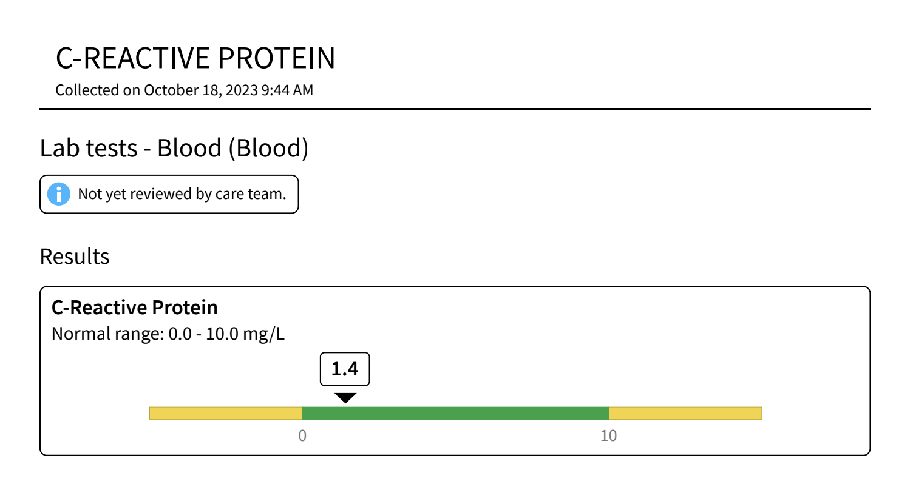

> The only metrics of interest was that my CRP levels had greatly decreased from the previous blood draw.

The hip aspiration was one of the most painful things I have ever experienced. The proceeded started with my doctor saying that he "really had done these on the hip before". I was laid on a table and they injected tiny needles with local anesthetic into my hip before they inserted a much larger needle to draw out the fluid. The much larger needle was guided by x-ray imaging and I was told to stay completely still. First, the anesthetic had almost no effect and I could feel the needle going into my hip. I was biting my lip so much it began to bleed so I switch to biting my hand and cussing. The doctor was having a very difficult time getting fluid out and I was unable to stay still due to the pain. A nurse then gave me a self-administered tube of nitrous oxide to help with the pain. I began to huff nitrous like my life depended on it and before I knew it I was so high that sound began to become distorted. The doctor and the x-ray technician began to argue, the needle got stuck, and they had to start over from a new angle. The doctor was finally able to remove 6ccs of fluid from my right hip. I left the appointment, violently high on nitrous, and in a wheelchair.

> If for some reason I ever need to get a hip aspiration again, I think I will skip it and take my $800 and spend it on medical grade nitrous oxide instead 😂. *0/10*

### Second Opinions

Right after being diagnosed, I knew that I needed to get more eyes on my results. If this disease is truly as rare as they say it is, then that also means that there has to be limited diagnostic experience with it as well. That means its quite possible I have been misdiagnosed and I don't actually have PVNS/TGCT.

> The chances of being stuck by lightning are [1 in 15,300](https://www.britannica.com/question/What-are-the-chances-of-being-struck-by-lightning#:~:text=The%20odds%20that%20one%20will,struck%20by%20lightning%20every%20year.) so surely I haven't developed a tumor with 39 in 1,000,000 odds, right?
>
> — <cite>britannica[^2]</cite>

[^2]: [britannica](https://www.britannica.com/question/What-are-the-chances-of-being-struck-by-lightning#:~:text=The%20odds%20that%20one%20will,struck%20by%20lightning%20every%20year.)

I first reached out to a family friend that recently retired from his career as an orthopedic surgeon. He reviewed my MRI report (not the actual images) and told me that it was very well written and did indeed make a strong case for TGCT.

Here is the actual MRI report for reference:

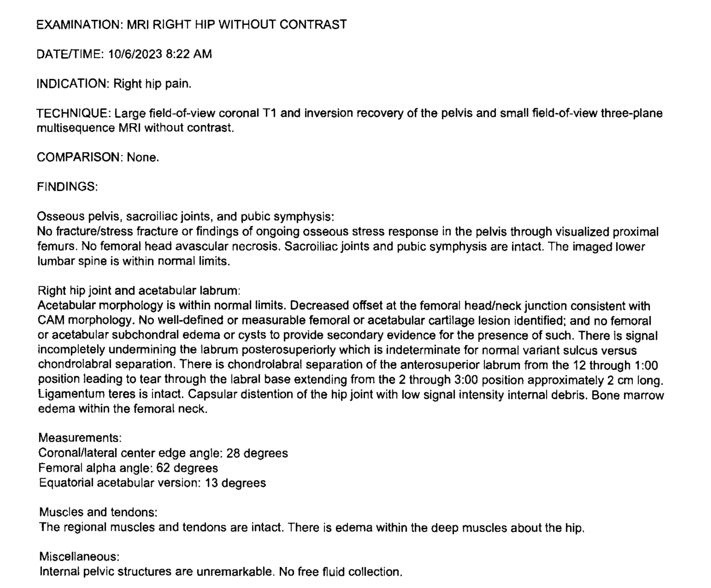
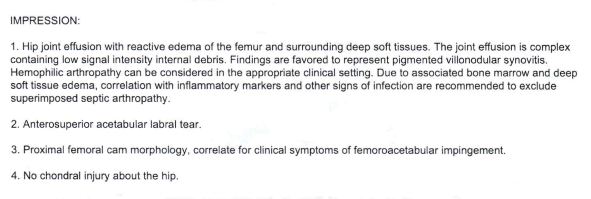

> My MRI report from `10/06/2023`

The doctor that our friend suggested I see right away was [Leslie B. Vidal](https://web.archive.org/web/20231210233324/https://www.thesteadmanclinic.com/our-doctors/leslie-b-vidal) with the Steadman Clinic in Vail, CO. This single suggestion would ultimately change the course of my entire treatment for the better.

I didn't book an appointment right away though, I had an upcoming camping trip in Utah, and I also was on a mission to try and figure out as much about this disease as possible before I saw another doctor as my last experience was not great.

### The Search for Information

This was probably the longest, most stressful, and mentally taxing portion of my journey. I spent countless hours reading research papers, watching videos, and trying to understand the disease as best as I could. I was trying to understand the disease, the treatment options, and the potential outcomes. Throughout this whole process, I was sending my stress levels through the roof. I was constantly thinking about the worst-case scenarios and I was not able to sleep well at all. Along the way, I stumbled across the [TGCT/PVNS support group](https://www.facebook.com/groups/1587642278156786) on Facebook. I joined the group and began to read through hundreds of posts and comments from other members. I would read about their surgeries, folks taking new medicines that were in clinical trials, and I would read about their own process of getting diagnosed.

In this support group, I noticied that there was one member who seemed highly active, and possessed a wealth of knowledge about the disease. Her name was Sydney Stern. I reached out to her via DMs and introduced myself, asked a few questions in regards to my situation, and asked why she was a member of the group. Reaching out to Sydney would be the very best decision I would make in my entire journey.

Sydney was in a similar boat as me. She had been diagnosed with PVNS/TGCT of the hip and had been through multiple surgeries and treatments. She was diagnosed many years ago when the support systems, research, and treatment options were not as advanced as they are today. She had been through it all and had answers to nearly every question I could possibly think of. She is also in the medical field, has a PhD, and from what I can tell she pretty much runs the entire non-profit for TGCT. During our conversations online, she said I could send her my MRI images and she would take a look at them. I sent her the images and she was able to walk me through what the results were, why the radiologist was making a case for TGCT, and what the next steps should be.

Here are the actual images she helped me to review from that initial MRI:

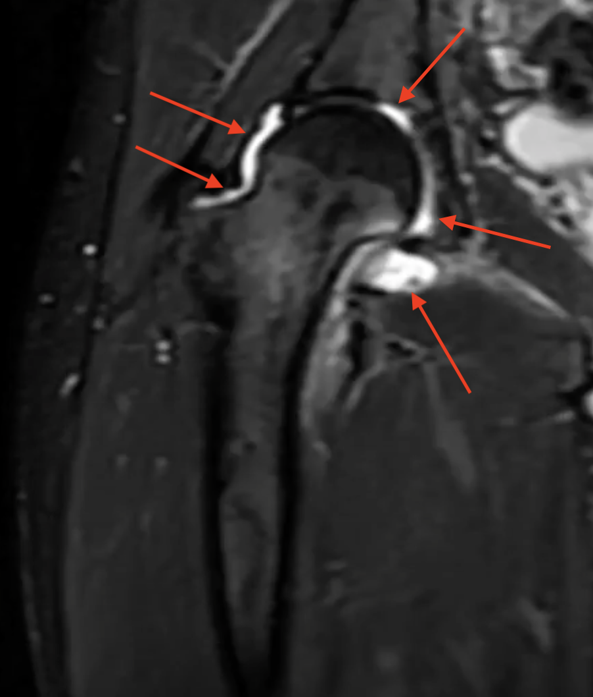
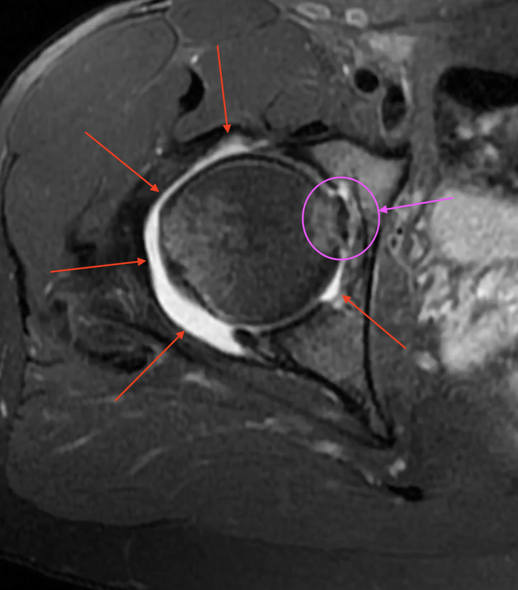

> My MRI images from `10/06/2023` - The red arrows are pointing to areas of fluid / inflammation. The magenta arrow + circle is highlighting the area of the "suspicous" mass.

Sydney was an absolutely **rock star** for me through this entire process to come!

---

So what was to happen next? I currently only had a referral to see Dr. Vidal in Vail, CO. I had a camping trip in Utah coming up, I was still waiting for my swelling to come down, and I had a lot of chats with Sydney regarding next steps. This process took a while and it was a journey through the trecherous waters of the US healthcare system. I will provide a high level overview of what all happened over the next few months in the *search-for-information*:

1. I went into "active monitoring" mode for the next month (October 2023 - November 2023). During this time, I took ibuprofen to help with the pain and swelling. I kept it light on my leg with minimal activity, went on my camping trip in Utah while being very careful, and scheduled an appointment with Dr. Vidal in Vail, CO for mid-November.
2. I had my in-person appointment with Dr. Vidal in Vail, CO. Her team was **absolutely fantastic** and incredibly thorough. She reviewed my MRI images, x-ray images (from June), and did a physical examination. She wanted me to get another MRI from the original MRI location. Her goal was to see if anything had changed since the last MRI, see if the mass was still present, and get a better idea of what was going on now that the swelling had subsided.
3. I relayed the information to Sydney and she provided me with an excellent suggestion. She suggested that I request this second MRI to be done with contrast and a GRE sequence. This would provide the best possible images for a potential mass in the joint. I relayed this information to Dr. Vidal and she agreed that this was a good idea.
4. I got the second MRI done with contrast and the GRE sequence. Before leaving the MRI appointment, I requested that the images were handed to me on a physical disk so that I could create mini videos of the images and send them to Syndey for review. (more to come on the results below)
5. The MRI results were cross reviewed by Dr. Vidal and her team. They agreed with the results in the report (again, this will be discussed below).
6. The MRI results were then cross reviewed by the *entire orthopedic oncology team* at CU Anschutz via a referral suggestion from a family member. This occured due to a failed attempt when trying to get an appointment with Bennie Lindeque who works in Orthopedic Oncology. Since I was unable to get an appointment without a biopsy, my MRI results were reviewed by the entire team during a monthly review meeting. Their review determined that there was "no signs of any tumor" and that I should just get a full hip replacement instead. This outcome proved to be entirely incorrect and I am very glad that I did not pursue any further advice from this team.
7. It was now the holiday (December) and I had an upcoming trip to Europe for a month with my partner. I had put most of my medical stuff on hold and was going to pick it back up when I returned in February.

> Quick side note: Why did I reach out to an orthopedic oncologist? Oncology means cancer right? No, not quite. Oncology is the study of tumors and cancer is a type of tumor. Orthopedic oncologists are the best doctors to see when you have a tumor in your bone or joint. Sydney suggested that I see an orthopedic oncologist because it would result in statistically better outcomes when compared to seeing a general orthopedic surgeon. This is because orthopedic oncologists are more familiar with the disease and have more experience with treating it.

So what were the results of the second MRI? Well here they are...

### Second MRI Results

I got the second MRI done during step #4 in the list seen above. This MRI took place on 11/15/2023, roughly one month after my first MRI.

#### MRI Report

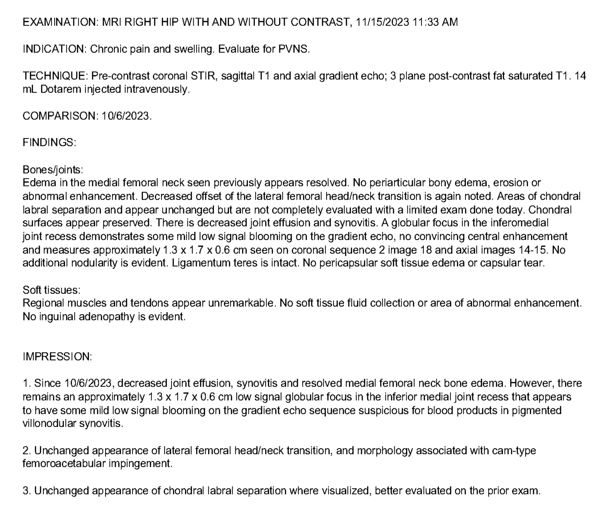

> MRI report from `11/15/2023`. Cross referencing the original MRI report.

The notable findings from the MRI report were:

- *Decreased joint effusion (fluid in the joint) and synovitis (inflammation of the synovium)*
  - This was a good sign as it meant that the swelling had gone down.
- *Labral separation appears unchanged*
  - The labral tear that was found in the first MRI was still present and hasn't gotten worse
- *Unchanged cam-type femoroacetabular impingement*
  - The hip impingement was still present and hadn't gotten worse (bone on bone contact)
- *1.3 x 1.7 x 0.6 cm low signal globular focus that appears suspicious for blood products in pigmented villonodular synovitis*
  - This was the most important part of the report. The mass was still present and it still continued to show characteristics of PVNS (TGCT).

#### MRI Images

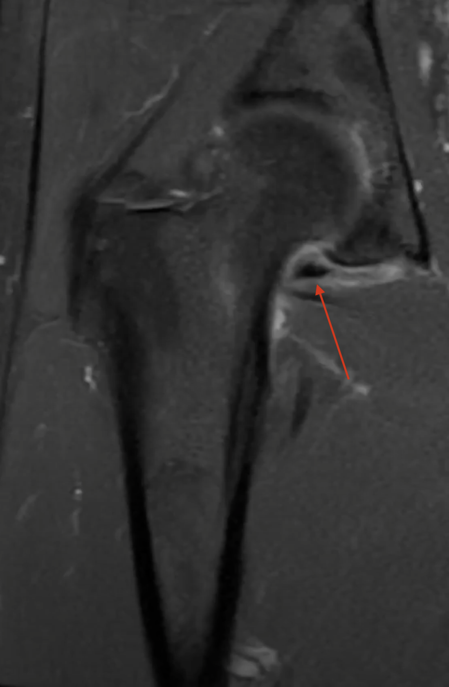

> Compared to my first MRI of this view (Cor T1 FS POST - unilateral) you can see the swelling has gone way down. However, there is still a suspicious area in the joint.

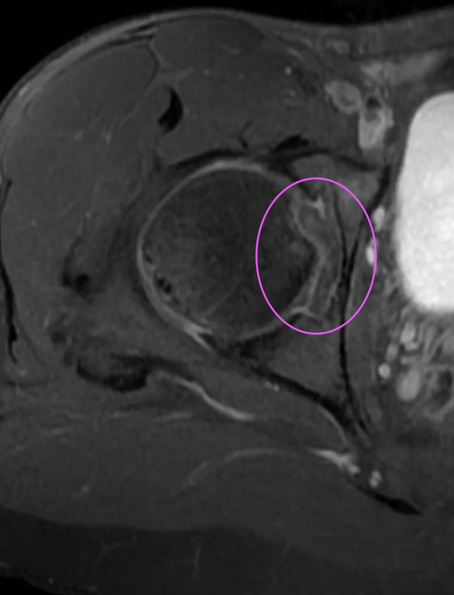

> In this view, (Ax T1 FS POST - unilateral) we see a very suspicious mass in the joint (magenta).

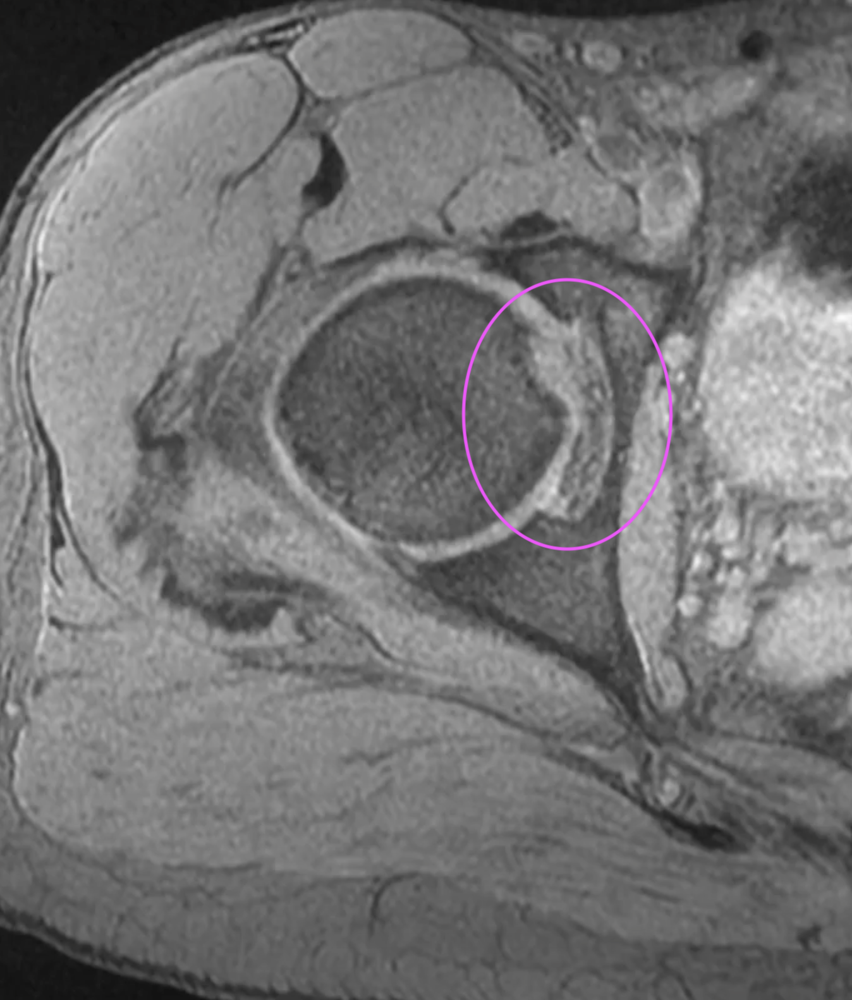

> In this view, (Ax T2* GRE) the mass is even more visible. Thanks GRE sequence with contrast and Sydney Stern!

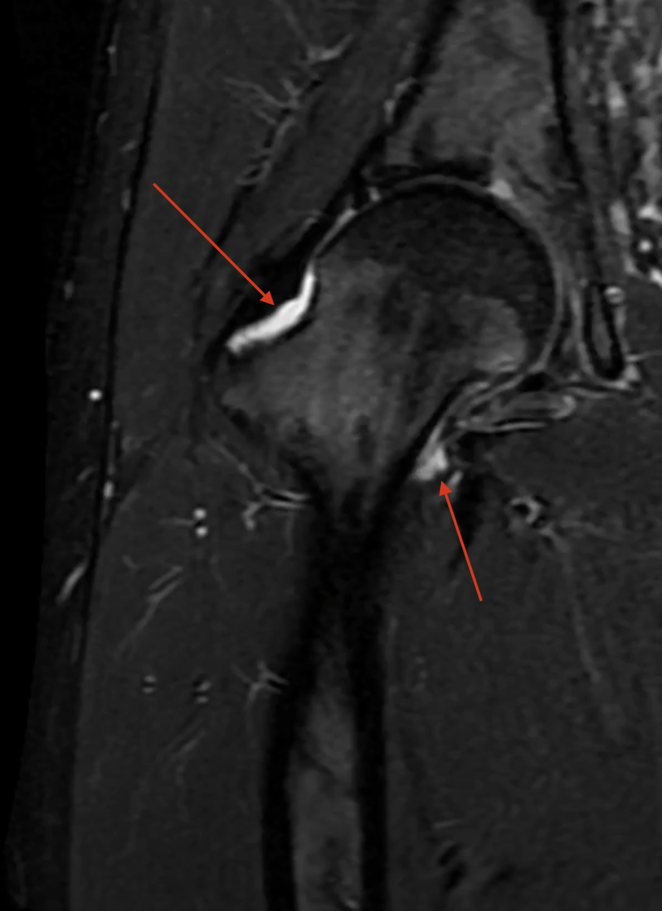

> In this view, (Cor STIR - unilateral) you can see that some inflammation is still present in the joint but it has gone down significantly. Arrows are pointing to fluid / inflammation areas.

#### MRI Videos

Here are a few video I made by scrolling through the MRI images:



> View: Sag T1 FS POST (unilateral)



> View: Ax T1 FS POST (unilateral)



> View: Ax T2_ GRE

### Making a Decision

Looking back on that quick *search-for-information* timeline, I got my second MRI (the results just above) in mid-November 2023 - flash forward and now we are at the start of February 2024. I had just returned from my trip to Europe and had done a lot of walking while on my trip. Throughout the whole trip, I was keeping it very mellow but I still noticed that my hip was getting worse. Some days I had a bit of a limp, some days I was extra sore, and some days I just had an overall feeling of discomfort. We spent some time in Sweden and I had to sit back on a lot of activities because of the risk of having another flare up while abroad. I wasn't able to go ice skating, cross country skiing, or even basic hikes.

I wasn't able to be myself and at 26 I felt like I was being held back.

My mind was made up. I was going to get this problem fixed and get back to all the fun activities I love to do.

I scheduled an appointment with Dr. Vidal in Vail, CO for mid-February 2024. During this appointment, she performed another physical exam and discussed treatment options. I still had a very symptomatic hip when testing for the impingement/labral tear, and I was also in discomfort for the mass. There was really only two options at this point:

1. **Anti-inflammatory Medications**: A very conservative approach that would involve taking anti-inflammatory medications daily (and indefinitely) to manage the symptoms. I would also not be able to do any high impact activities.
2. **Hip Arthroscopy**: This would be a minimally invasive surgery where they would go in and fix the labral tear, shave down the bone to fix the impingement (cam-type), and remove the mass.

There was no question as to what I was going to do. I was going to get the [hip arthroscopy](https://en.wikipedia.org/wiki/Hip_arthroscopy).

Before leaving the appointment, Dr. Vidal had me get one last MRI that afternoon at their clinic. This MRI has nearly double the resolution of the previous MRI and would be used to plan the surgery.

> Due to this MRI being double the resolution, it wasn't even required to get it done with contrast or a GRE sequence.

The third MRI did not show anything new or noteworthy. It was just used to plan the surgery and to make sure that there was nothing else going on in the joint that would be a suprise during the surgery.

### Surgery

The surgery was scheduled for `03/01/2024` - approximately 2 weeks after my appointment with Dr. Vidal.

Leading up to the surgery, I did a considerable amount of stretching and exercises to prepare for the recovery. I wanted to ensure that I would have the best possible outcome and that I would be able to recover as quickly as possible.

Here is a list of the exercises I did (ceased ~3 days before surgery):

- Hip Flexor Stretches
- Hamstring Stretches
- Calf Stretches
- Glute Stretches
- Quad Stretches
- 3 miles of stationary biking per day
- Full upper body workout (chest, back, shoulders, arms) - one group per day, daily
- Core exercises (planks, leg raises, hollow crunches, etc.)

I also made sure to eat a very healthy diet and to get plenty of sleep leading up to the surgery.

The day before surgery, my partner and I drove to Vail, CO and stayed in a hotel. We had to be at the hospital at 6:00am the next day.

The check-in and pre-op process was very smooth. I filled out some forms, got changed into a hospital gown, and then was taken to a pre-op room. I met with the anesthesiologist and Dr. Vidal before the surgery. They both went over the procedure and what to expect. I was given a muscle relaxer, and an opioid to get the pain management under control before the surgery even started. Compression socks were put on my legs to prevent blood clots and an IV was started with saline. The anesthesiologist explained to me that I would be put under [general anesthesia](https://en.wikipedia.org/wiki/General_anaesthesia) and a breathing tube would be inserted to help me breathe during the surgery. I was also given a nerve block in my hip to help with the pain after the surgery. Lastly, he explained that I would be given a medication that would fully paralyze me during the surgery to prevent any movement that could cause injury.

Dr. Vidal came in and marked my hip with a sharpie and explained that she would expect the surgery to take 2-3 hours to my partner. During the surgery I would have [intermittent pneumatic compression](https://en.wikipedia.org/wiki/Intermittent_pneumatic_compression) socks on my legs. These socks would inflate and deflate to help with blood flow and to prevent blood clots in my legs as a precaution. My right leg would also be tightened into a [traction boot](https://github.com/GrantBirki/tgct/assets/23362539/7eeaf555-ca7b-439c-a894-8b9404a4dbd6) which would aid in slightly distracting the hip joint to make the surgery easier. I would also be given a very large dose of antibiotics via my IV as another precaution to prevent infection from the surgery.

> Side note: Yes all the information about what would take place during the surgery sounds scary. As this information was being explained to me, my heart rate was increasing, I was having cold sweats, and felt like I wanted to run out of the pre-op room. I told the pre-op nurse that I was feeling this way and she told me that if I wasn't anxious then I wouldn't be normal. It was only until after I woke up from the surgery that I would realize that I had nothing to worry about.

At this point, I was ready to "rock and roll" for surgery. Dr. Vidal stepped out of the room to get scrubbed in and the anesthesiologist placed a tube near my nose with funny smelling gas. I asked him if it was nitrous oxide and he said "no, its something wayyy better". I blacked out within seconds and the next this I knew, I was waking up in the recovery room.

### Recovery

Like all surgeries, the first part of recovery starts in the post anesthesia care unit (PACU). This is where they monitor you as you wake up from general anesthesia. Some people can have a hard time waking up from general anesthesia or feel nasueous. I did not have any issues, so they moved my groggy self to a recovery room. As I was starting to wake up, the nurse explained to me that she was going to give me a dose of pain medication "just in case" (I had no pain). I asked what she was going to give me and she said "fentanyl". Moments later I went *night-night* and woke up about an hour later. I was still groggy, and now also high as a kite from the fentanyl. I remember really wanting to eat jello so I slurpped down a few cups and had apple juice. I told the nurse how happy the jello made me and she asked if I wanted to see my partner now. I said "yes" so she sent in Leah to be with me.

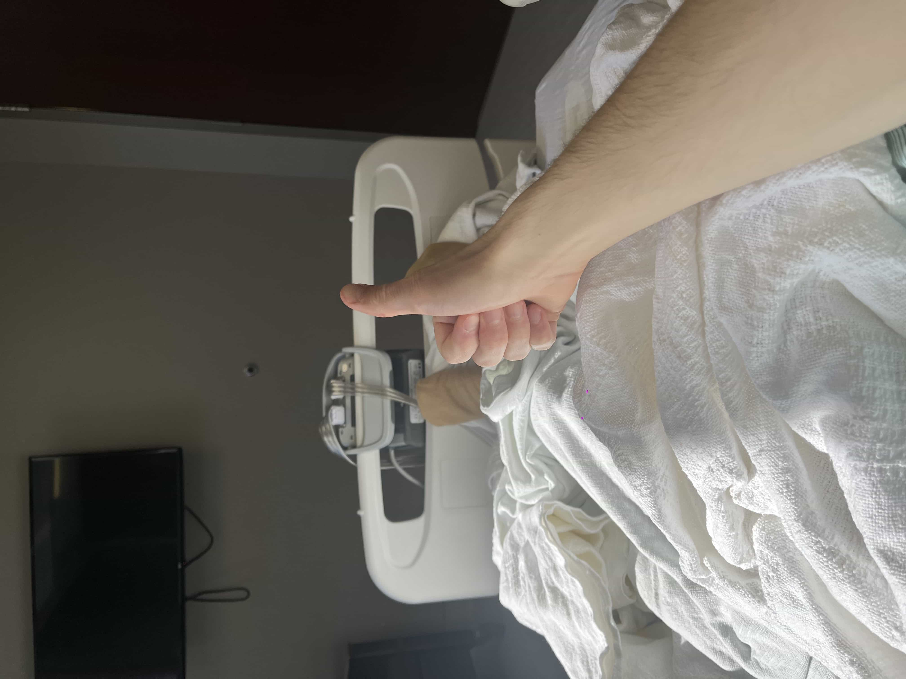

The recovery in the hospital was an incredibly smooth process. In fact, my only complaint was that it took too long and I wished I could have gone home even earlier! I had no pain, didn't require any additional medicaition, wasn't nauseous, and nothing was numb. I was able to walk around on crutches okay (required to do so before being discharged) and I was able to urinate. In fact, I was able to urinate **a lot**.

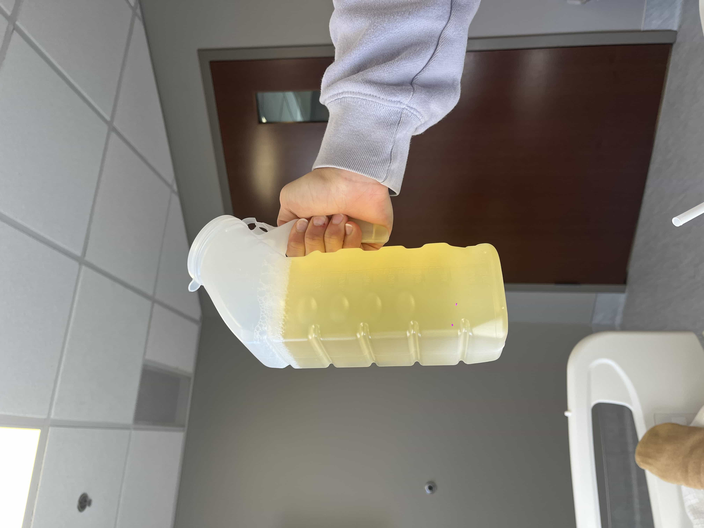

> I filled an entire bottle and actually had to stop peeing because it filled up. Sorry if that's TMI, but that was just absurd.

I was discharged from the hospital around 3:00pm and we drove back to Steamboat Springs, CO. I was able to sit in the car just fine for the hour and a half drive and still had no pain. I was feeling great and mainly just tired.

---

For the first few days, I was very dependent on my partner (Leah), to help me with pretty much all basic tasks. I needed help making food, getting dressed, and getting out of bed. Some of these tasks like getting out of bed, could have potentially been done on my own, but it was highly recommended to have a helper to avoid potential injury. I was on crutches and was not allowed to put any weight on my right leg. I was also wearing a hip brace that would prevent my leg from moving in certain directions - external rotation, or past 90 degrees of flexion.

I still had no pain, and was not taking any opioids/narcotics. I was on a rotating schedule of acetaminophen, ibuprofen, and aspirin. The aspirin was to help prevent blood clots since I was spending most of my time laying down. I only had to take a total of 2 doses of opioids and it was due to my heel hurting from the traction boot. I could have done without the opioids, but I really just wanted to get good sleep and not think about my throbbing heel.

For my diet, I was eating a lot of granola, yogurt, and fruit. I was also drinking a ton of water and supplementing with Ensure drinks. Avoiding large meals was important for me to prevent indigestion since I was laying down most of the time.

After my surgery, I was also sent home with a [continuous passive motion](https://en.wikipedia.org/wiki/Continuous_passive_motion) (CPM) machine. This machine would move my leg up and down to help prevent scar tissue and muscle stiffness. I would spend about 4-6 hours a day in this machine and I started using it the very next day after surgery. The CPM machine would only be required for the first three weeks after surgery.

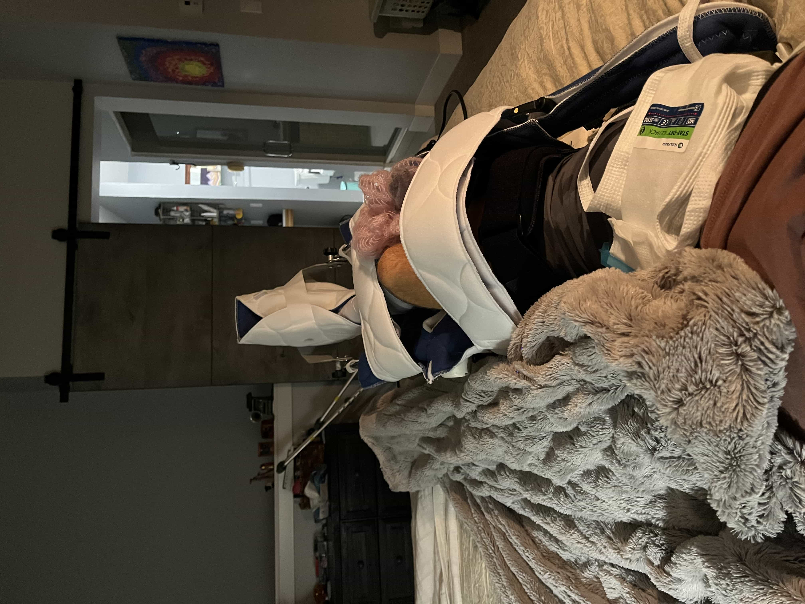

> Me using the CPM machine the day after surgery.

While using the CPM machine, I would be doing calf pumps and quad squeezes to help with blood flow and to help keep my toes warm.

The next two weeks were pretty boring overall but that is actually a good thing in this case. I was able to do some work from my laptop, watch a ton of movies, and spend a lot of time resting. I continued to have virtually no paid at all and was able to sleep through most nights without any issues. The next thing I knew, it would be two weeks out from surgery, and I would be active in physical therapy.

#### Pathology Report

During these first two weeks, I also got a call from Dr. Vidal to check-in on me and go over the surgery results and the biopsy.

Overall, the surgery was incredibly successful. She was able to shave down the bone causing my hip impingment, fix the labral tear, and fully remove the mass. Fortunately, the mass had very clear boundries an she was able to "pluck" it out in one piece. She then cauterized the area it was attached to to prevent any future growth. The mass was sent to pathology and the results came back as expected. I did indeed have TGCT (PVNS) in the nodular form. All things considered, this was actually great news. The mass was a benign tumor, it was fully removed, and it was removed in a way that would make it very unlikely to return.

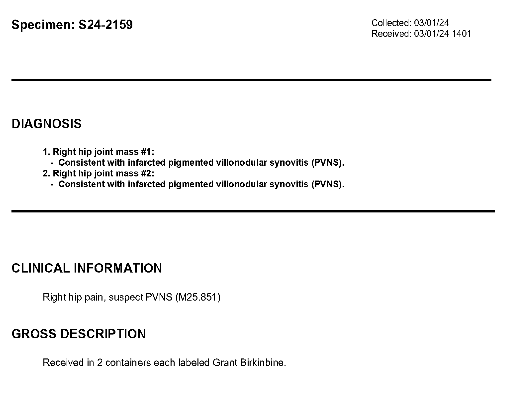
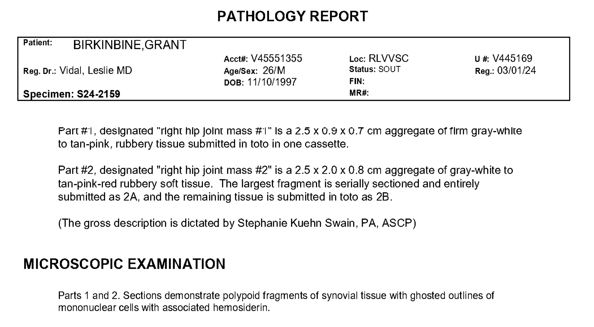

> Post surgery pathology report

### Long Term Recovery

I'm currently writing this almost 3 weeks out from my surgery. I'm still being cautious on crutches and I'm starting to begin weight bearing on my right leg. So far the process has been a breeze and I'm feeling great! Still no pain at all which has amazed me and also my surgery team. Yesterday I went to an outdoor concert, and out to happy hour with some of my family. I was using crutches but just to be able to get out and about so soon after surgery was amazing.

My hip actually feels so much better than it did before surgery. I'm quite optimistic that my hip will actually be better than it was before my journey with TGCT started. My hip impingement is gone, the labral tear is fixed, and the mass is gone.

Of course there is always a risk of the mass returning, but that risk is very low. In fact, Dr. Vidal said that the operation went so well that the risk of recurrence is less than 5%. I will still need to be monitored with occasional MRIs, but it's not something I'm going to worry about. Instead, I'm going to be worrying about how I'm every going to fit in all the activities I want to do now that I'm going to be pain free and back to an even better self!

> I will be updating this section as I continue to recover if anything changes. If you don't see any updates, then that means I have nothing interesting to report 😉

### Conclusion

TGCT is a rare, unique, and special club that *nobody* wants to be a part of. Despite that, I am so incredibly grateful that this club contains a truly outstanding member, Sydney Stern. I would like to think of my experience with TGCT as a success story... a success story that has been a decade in the making through the dedication, expertise, and obstaces that many others have faced before me.

*The people before me with TGCT ~~walked~~ limped so that I could run...*

My experience with TGCT began and ended in less than a year. For the majority of those diagnosed with TGCT, this would be a dream come true. I am incredibly fortunate to have had access to resources such as [tgctsupport](https://www.tgctsupport.org/), the expertise of world-class surgeons like Dr. Vidal, the guidance of brilliant individuals in the field like Sydney Stern, and the unwavering support of my family, especially Leah.

I hope that my story can be found by others who are going through the ups and downs of finding out they have TGCT. I hope that my story can provide some sort of comfort and guidance to those who are unsure about what lies ahead of them in the journey with TGCT.

— Grant

### Acknowledgements and References

- [tgctsupport.org](https://www.tgctsupport.org/) - Life Raft Group 501 (c)(3) non-profit organization
- [NORD](https://rarediseases.org/rare-diseases/tenosynovial-giant-cell-tumor/) - National Organization for Rare Disorders
- [TGCT/PVNS support group](https://www.facebook.com/groups/1587642278156786)
- [The Steadman Clinic](https://web.archive.org/web/20240227022554/https://www.thesteadmanclinic.com/)
- Sydney Stern 🙇

### Open Source Data

In an effort to help others with TGCT, the medical community, and researchers, I have decided to make my medical records and images related to TGCT open source. All of this data is available in the [`data/`](https://github.com/GrantBirki/tgct/tree/main/data) directory of this repository on GitHub. These documents are placed under the [MIT](https://opensource.org/license/mit) license and are free to use.

These documents include:

- MRI images
- X-Ray images
- Pathology reports
- Blood work
